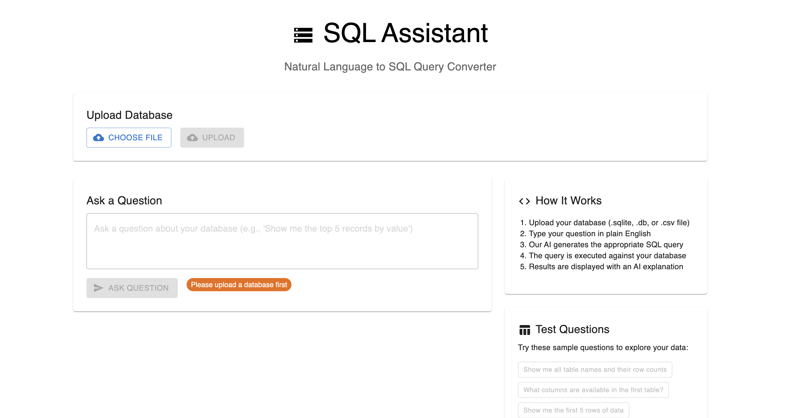

# SQL Assistant

A natural language to SQL query converter with a web interface.



## Project Structure

```
sql-assist/
├── backend/                 # Python backend
│   ├── __init__.py
│   ├── database.py         # Database management
│   ├── models.py           # Data models and types
│   ├── sql_assistant.py    # Main SQL assistant logic
│   ├── utils.py            # Utility functions
│   ├── api.py              # Flask API server
│   ├── main.py             # CLI entry point
│   ├── requirements.txt    # Python dependencies
│   └── data/               # Database files
├── frontend/               # React frontend
│   ├── public/
│   ├── src/
│   └──package.json
└── README.md               # This file
```

## Features

- **Natural Language Processing**: Convert plain English questions to SQL queries
- **Multiple Database Support**: Works with SQLite databases (Chinook, Sakila, etc.)
- **AI-Powered**: Uses Google Gemini for query generation and validation
- **Modern Web Interface**: React-based frontend with Material-UI
- **RESTful API**: Flask backend with CORS support
- **Real-time Results**: Execute queries and display results instantly

## Prerequisites

- Python 3.8+
- Node.js 16+
- Google Gemini API key

## Setup

### 1. Backend Setup

```bash
cd backend

# Create virtual environment
python -m venv env
source env/bin/activate  # On Windows: env\Scripts\activate

# Install dependencies
pip install -r requirements.txt

# Set environment variables
export GOOGLE_API_KEY="your_gemini_api_key_here"
export LANGSMITH_API_KEY="your_langsmith_key_here"  # Optional
```

### 2. Frontend Setup

```bash
cd frontend

# Install dependencies
npm install
```

## Running the Application

### Option 1: Web Interface (Recommended)

1. **Start the Backend API Server:**

   ```bash
   cd backend
   source env/bin/activate
   python -m flask run --app api:app --host=0.0.0.0 --port=5000
   ```

2. **Start the Frontend:**

   ```bash
   cd frontend
   npm start
   ```

3. **Open your browser** and navigate to `http://localhost:3000`

## API Endpoints

- `POST /api/init` - Initialize database connection
- `POST /api/query` - Process natural language query
- `POST /api/test` - Run test queries
- `GET /api/health` - Health check

## Usage Examples

### Natural Language Questions

- "Who are the top 3 best selling artists?"
- "What are the 5 most popular music genres?"
- "Which customers have spent the most money?"
- "Show me the longest tracks in the database"
- "What are the total sales by country?"

### Database Support

The application automatically detects and supports:

- SQLite databases (e.g., Chinook, Sakila)

## Configuration

### Environment Variables

Create a `.env` file in the backend directory:

```env
GOOGLE_API_KEY=your_gemini_api_key_here
LANGSMITH_API_KEY=your_langsmith_key_here
```

### Model Configuration

In `backend/sql_assistant.py`, you can modify:

- `model_name`: Change the Gemini model (default: "gemini-2.0-flash-lite")
- `temperature`: Adjust AI creativity (default: 0.1)
- `top_k`: Maximum results returned (default: 5)

## Development

### Backend Development

- **Adding new database types**: Modify `backend/database.py`
- **Extending SQL logic**: Update `backend/sql_assistant.py`
- **API endpoints**: Add routes in `backend/api.py`

### Frontend Development

- **UI components**: Modify `frontend/src/App.js`
- **Styling**: Update Material-UI theme or add custom CSS
- **API integration**: Update API calls in the React components

## Troubleshooting

### Common Issues

1. **Database not found**: Ensure database files are in `backend/data/`
2. **API connection failed**: Check if backend server is running on port 5000
3. **Gemini API errors**: Verify your API key is correct and has sufficient quota
4. **Frontend build errors**: Clear `node_modules` and reinstall dependencies

## License

This project is open source and available under the MIT License.
